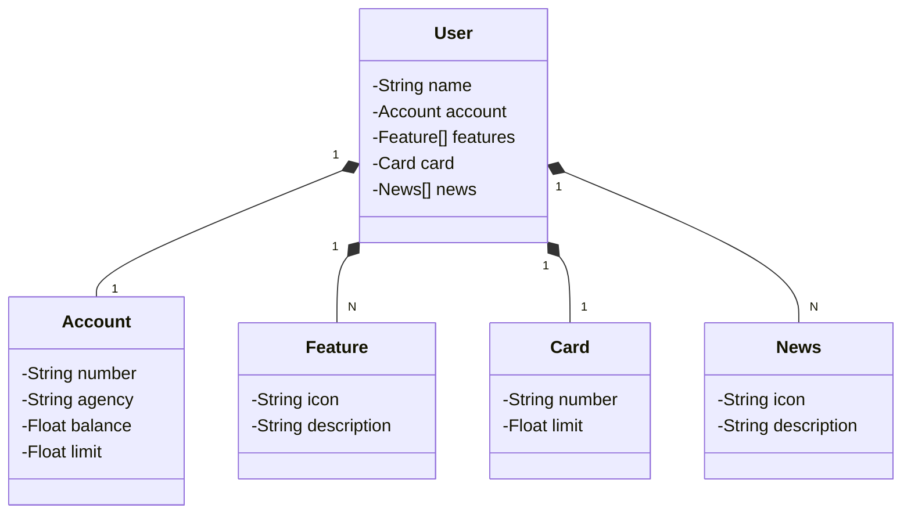

# Santander Dev Week
Java RESTful API  criada para a Santander Dev Week

## Diagrama de classes

### Explicação
- **User** é a classe principal, representando o usuário. Ela possui os seguintes atributos:
  - `name`: Nome do usuário.
  - `account`: Representa a conta bancária do usuário.
  - `features`: Lista de funcionalidades disponíveis.
  - `card`: Representa o cartão associado ao usuário.
  - `news`: Lista de novidades relacionadas ao usuário.

- As demais classes detalham os objetos internos:
  - **Account**: Representa os dados da conta bancária, como número, agência, saldo e limite.
  - **Feature**: Detalha uma funcionalidade, incluindo um ícone e uma descrição.
  - **Card**: Contém informações sobre o cartão, como número e limite.
  - **News**: Representa uma novidade, com ícone e descrição.

- **Relacionamentos**:
  - **User** está relacionado a:
    - **Account**: Composição (relação "um para um").
    - **Feature**: Lista de funcionalidades (relação "um para muitos").
    - **Card**: Composição (relação "um para um").
    - **News**: Lista de novidades (relação "um para muitos").
